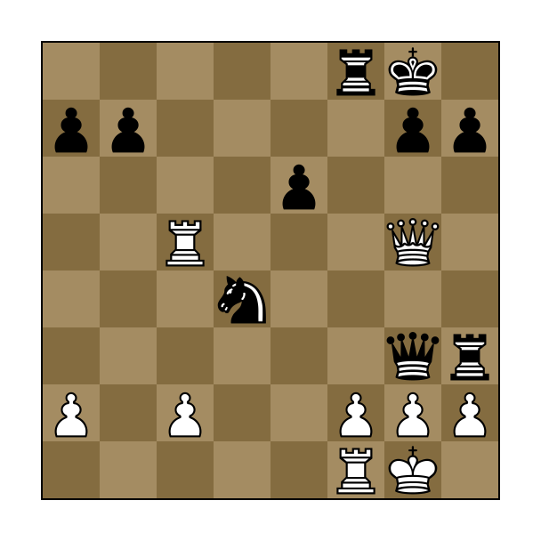

# svgboard

`svgboard` is a short and simple C code for the generation of beautifully
rendered SVG chess board diagrams from input FEN strings. By default the output
is written to stdout, but it can be redirected to a file of your choosing.

For example,
```
svgboard '5rk1/pp4pp/4p3/2R3Q1/3n4/6qr/P1P2PPP/5RK1 w - - 2 24' > goldcoin.svg
``` 
generates the board



The board can be configured to the user's tastes using a number of command-line
options and flags:
```
Usage: svgboard [-cghir] [-p <pieces>] FEN
	-b		 border thickness (default: 2)
	-c		 turn on coordinates (default: 0)
	-d		 dark square color (default: 846c40)
	-f		 font size (default: 20)
	-F		 font name (default: sans-serif)
	-g		 grayscale, suitable for print
	-i		 show side-to-move indicator
	-l		 light square color (default: a48c62)
	-m		 margin size (default: 48)
	-p <pieces>	 pieces to use (default: merida)
	-r 		 flip if black to move instead of indicator
	-s 		 square size (default: 64)
```

To run the program, download or clone the git repo and run `make` in the repo directory. This will create the binary `svgboard` which can be either run locally with `./svgboard` or copied to somewhere in your shell's path.
